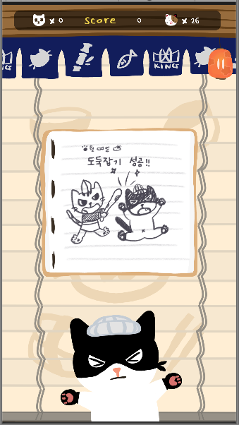

# SushiStack 

> SushiStack은 Unity 2D와 C#을 이용하여 개발된 안드로이드 모바일 캐쥬얼 게임입니다.   회전초밥 집에 방문하는 고양이 손님을 위해서 초밥과 접시를 받아 서빙하면 됩니다.

 

# 1. Downloads

SushiStack v1.3 APK https://drive.google.com/open?id=1jIJkFhSrdgqwc8Pokq1dCzphomxFWCPG

 

# 2. 게임 방법 및 인게임 이미지

(1) 메인화면(Main)
---

 

(2) 스테이지화면(Stage)
---
   

   

 

- 모바일 기기의 스크린을 드래그하여, 고양이 손님을 좌우로 움직일 수 있습니다.

- 사용자는 고양이 손님을 조작하여 화면 상단에서 떨어지는 접시와 초밥, 아이템을 탑을 순서대로 쌓듯 받아야 합니다.

- 거북이, 장국, 무지개접시 등의 특수 아이템으로 점수를 더 많이 얻을 수 있습니다.

- 플레이 시간, 받은 초밥, 손님의 수 등을 이용하여 최종점수를 계산합니다. 

 

(3) 상점 및 컬렉션 시스템(Store & Collection)
---

   

 

- 사용자의 점수는 코인으로 변환되어 여러 아이템을 구매할 수 있습니다.

- 높은 점수를 얻을 수록 새로운 초밥이 등장하며, 가게의 칭호도 획득할 수 있습니다.

 

# 개발자 정보

 

**이화여자대학교 컴퓨터공학과 게임제작 동아리 KING**

**박유진([@jinee525](https://github.com/jinee525))** - PM, 기획, 그래픽

**김하정([@Kim-Ha-Jeong](https://github.com/Kim-Ha-Jeong))** - 기획

**장소정([@sojung127](https://github.com/sojung127))** - 개발

**정유진([@Yoojin99](https://github.com/Yoojin99))** - 개발

**조예원([@QueenCurry](https://github.com/QueenCurry))** - 개발, 그래픽

